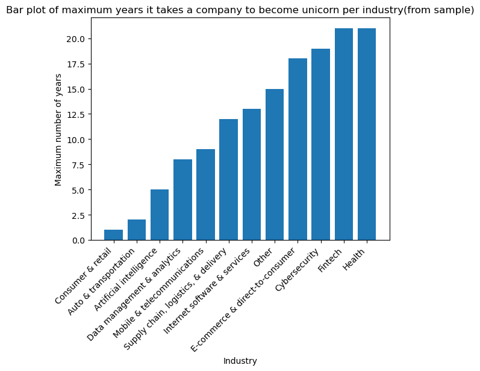
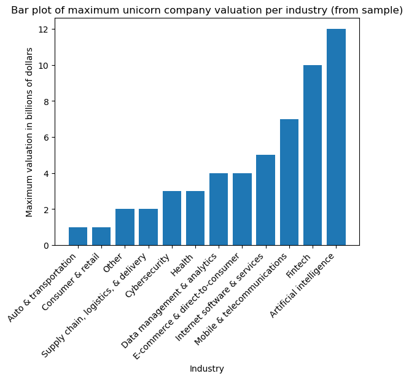

## Introduction

In this activity, we will discover the characteristics of a dataset and use visualizations to analyze the data. This will develop and strengthen your skills in Exploratory Data Analysis (EDA) and your knowledge of functions that allow you to explore and visualize data.

EDA is an essential process in data science workflow because it helps you to understand the data at hand and determine how it can be used to solve the problem you want to address. This activity will give you an opportunity to practice that process and prepare you for EDA in future projects.

In this activity, you are a member of an analytics team that provides insights to an investing firm. To help them decide which companies to invest in next, the firm wants insights into unicorn companies–companies that are valued at over one billion dollars. The data you will use for this task provides information on over 1,000 unicorn companies, including their industry, country, year founded, and select investors. You will use this information to gain insights into how and when companies reach this prestigious milestone and to make recommendations for next steps to the investing firm.

## Step 1: Imports

### Import libraries and packages
First import relevant Python libraries and modules. Use the `pandas` library and the `matplotlib.pyplot` module,


```python
# import libraries and packages
import pandas as pd
import numpy as np
import matplotlib.pyplot as plt
import datetime as dt
```

### Load the dataset into a DataFrame

The dataset provided is in the form of a CSV file named `Unicorn_Companies.csv` and contains a subset of data on Unicorn companies. 


```python
# import the dataset
companies = pd.read_csv('Unicorn_Companies.csv')
```

## Step 2: Data exploration

### Displaying the first 10 rows of data
Next, explore the dataset to answer questions in your exploration and analysis of the data. To begin, let us display the first 10 rows of data to see how the dataset is structured.


```python
# the first 10 rows of data from the companies df.
companies.head(10)
```


<div>
<style scoped>
    .dataframe tbody tr th:only-of-type {
        vertical-align: middle;
    }

    .dataframe tbody tr th {
        vertical-align: top;
    }

    .dataframe thead th {
        text-align: right;
    }
</style>
<table border="1" class="dataframe">
  <thead>
    <tr style="text-align: right;">
      <th></th>
      <th>Company</th>
      <th>Valuation</th>
      <th>Date Joined</th>
      <th>Industry</th>
      <th>City</th>
      <th>Country/Region</th>
      <th>Continent</th>
      <th>Year Founded</th>
      <th>Funding</th>
      <th>Select Investors</th>
    </tr>
  </thead>
  <tbody>
    <tr>
      <th>0</th>
      <td>Bytedance</td>
      <td>$180B</td>
      <td>4/7/17</td>
      <td>Artificial intelligence</td>
      <td>Beijing</td>
      <td>China</td>
      <td>Asia</td>
      <td>2012</td>
      <td>$8B</td>
      <td>Sequoia Capital China, SIG Asia Investments, S...</td>
    </tr>
    <tr>
      <th>1</th>
      <td>SpaceX</td>
      <td>$100B</td>
      <td>12/1/12</td>
      <td>Other</td>
      <td>Hawthorne</td>
      <td>United States</td>
      <td>North America</td>
      <td>2002</td>
      <td>$7B</td>
      <td>Founders Fund, Draper Fisher Jurvetson, Rothen...</td>
    </tr>
    <tr>
      <th>2</th>
      <td>SHEIN</td>
      <td>$100B</td>
      <td>7/3/18</td>
      <td>E-commerce &amp; direct-to-consumer</td>
      <td>Shenzhen</td>
      <td>China</td>
      <td>Asia</td>
      <td>2008</td>
      <td>$2B</td>
      <td>Tiger Global Management, Sequoia Capital China...</td>
    </tr>
    <tr>
      <th>3</th>
      <td>Stripe</td>
      <td>$95B</td>
      <td>1/23/14</td>
      <td>Fintech</td>
      <td>San Francisco</td>
      <td>United States</td>
      <td>North America</td>
      <td>2010</td>
      <td>$2B</td>
      <td>Khosla Ventures, LowercaseCapital, capitalG</td>
    </tr>
    <tr>
      <th>4</th>
      <td>Klarna</td>
      <td>$46B</td>
      <td>12/12/11</td>
      <td>Fintech</td>
      <td>Stockholm</td>
      <td>Sweden</td>
      <td>Europe</td>
      <td>2005</td>
      <td>$4B</td>
      <td>Institutional Venture Partners, Sequoia Capita...</td>
    </tr>
    <tr>
      <th>5</th>
      <td>Canva</td>
      <td>$40B</td>
      <td>1/8/18</td>
      <td>Internet software &amp; services</td>
      <td>Surry Hills</td>
      <td>Australia</td>
      <td>Oceania</td>
      <td>2012</td>
      <td>$572M</td>
      <td>Sequoia Capital China, Blackbird Ventures, Mat...</td>
    </tr>
    <tr>
      <th>6</th>
      <td>Checkout.com</td>
      <td>$40B</td>
      <td>5/2/19</td>
      <td>Fintech</td>
      <td>London</td>
      <td>United Kingdom</td>
      <td>Europe</td>
      <td>2012</td>
      <td>$2B</td>
      <td>Tiger Global Management, Insight Partners, DST...</td>
    </tr>
    <tr>
      <th>7</th>
      <td>Instacart</td>
      <td>$39B</td>
      <td>12/30/14</td>
      <td>Supply chain, logistics, &amp; delivery</td>
      <td>San Francisco</td>
      <td>United States</td>
      <td>North America</td>
      <td>2012</td>
      <td>$3B</td>
      <td>Khosla Ventures, Kleiner Perkins Caufield &amp; By...</td>
    </tr>
    <tr>
      <th>8</th>
      <td>JUUL Labs</td>
      <td>$38B</td>
      <td>12/20/17</td>
      <td>Consumer &amp; retail</td>
      <td>San Francisco</td>
      <td>United States</td>
      <td>North America</td>
      <td>2015</td>
      <td>$14B</td>
      <td>Tiger Global Management</td>
    </tr>
    <tr>
      <th>9</th>
      <td>Databricks</td>
      <td>$38B</td>
      <td>2/5/19</td>
      <td>Data management &amp; analytics</td>
      <td>San Francisco</td>
      <td>United States</td>
      <td>North America</td>
      <td>2013</td>
      <td>$3B</td>
      <td>Andreessen Horowitz, New Enterprise Associates...</td>
    </tr>
  </tbody>
</table>
</div>


Question: What do you think the "Date Joined" column represents?
- The 'Date Joined' column represents when the company became a 'unicorn', reaching a 1 billion dollars in valuation.

**Question:** What do you think the "Select Investors" column represents?
- The 'Select Investors' column represents the top investors in the company.

### Assess the size of the dataset.
Get a sense of how large the dataset is. The `size` property that DataFrames have can help.


```python
# the size of the dataset.
companies.size
```


    10740


Question: What do you notice about the size of the dataset?
- The size of the dataset is 10740. This means that there are 10740 entries across the entire dataset.

### Determine the shape of the dataset
Identify the number of rows and columns in the dataset. The `shape` property that dataframes have can help.


```python
companies.shape
```


    (1074, 10)


Question: What do you notice about the shape of the dataset?
- The shape of the dataset is (1074, 10). This means that it has 1074 rows (also known as entreis) and 10 columns (aspects). According to the dataset, there are 1074 Unicorn companies as of March 2022, and this dataset also shows 10 aspects of each company.

### Get basic information about the dataset
To further understand what the dataset entails, get basic information about the dataset, including the data type of values in each column. Although there is more than one way of doing this, we are going to use `info()` function from `pandas`.


```python
# get basic information about the dataset.
companies.info()
```

    <class 'pandas.core.frame.DataFrame'>
    RangeIndex: 1074 entries, 0 to 1073
    Data columns (total 10 columns):
     #   Column            Non-Null Count  Dtype 
    ---  ------            --------------  ----- 
     0   Company           1074 non-null   object
     1   Valuation         1074 non-null   object
     2   Date Joined       1074 non-null   object
     3   Industry          1074 non-null   object
     4   City              1058 non-null   object
     5   Country/Region    1074 non-null   object
     6   Continent         1074 non-null   object
     7   Year Founded      1074 non-null   int64 
     8   Funding           1074 non-null   object
     9   Select Investors  1073 non-null   object
    dtypes: int64(1), object(9)
    memory usage: 84.0+ KB
    

**Question:** What do you notice about the type of data in the `Year Founded` column? Refer to the output from using `info()` above. Knowing the data type of this variable is helpful because it indicates what types of analysis can be done with that variable, how it can be aggregated with other variables, and so on.
- The `Dtype` in the `Year Founded`column is an `int64`. This means that the year a company was founded is represented as an integer.

**Question:** What do you notice about the type of data in the `Date Joined` column? Refer to the output from using `info()` above. Knowing the data type of this variable is helpful because it indicates what types of analysis can be done with that variable and how the variable can be transformed to suit specific tasks.
- The `Dtype` in the `Date Joined` column is listed as `object`. This means that the date a company became a unicorn is represented as a string.

## Step 3: Statistical tests

### Find descriptive statistics
Find descriptive statistics and structure your dataset. The `describe()` from `pandas` library can help. This function generates statistics for the numeric columns in the dataset.


```python
companies.describe()
```


<div>
<style scoped>
    .dataframe tbody tr th:only-of-type {
        vertical-align: middle;
    }

    .dataframe tbody tr th {
        vertical-align: top;
    }

    .dataframe thead th {
        text-align: right;
    }
</style>
<table border="1" class="dataframe">
  <thead>
    <tr style="text-align: right;">
      <th></th>
      <th>Year Founded</th>
    </tr>
  </thead>
  <tbody>
    <tr>
      <th>count</th>
      <td>1074.000000</td>
    </tr>
    <tr>
      <th>mean</th>
      <td>2012.895717</td>
    </tr>
    <tr>
      <th>std</th>
      <td>5.698573</td>
    </tr>
    <tr>
      <th>min</th>
      <td>1919.000000</td>
    </tr>
    <tr>
      <th>25%</th>
      <td>2011.000000</td>
    </tr>
    <tr>
      <th>50%</th>
      <td>2014.000000</td>
    </tr>
    <tr>
      <th>75%</th>
      <td>2016.000000</td>
    </tr>
    <tr>
      <th>max</th>
      <td>2021.000000</td>
    </tr>
  </tbody>
</table>
</div>


**Question:** Based on the table of descriptive stats generated above, what do you notice about the minimum value in the `Year Founded` column? This is important to know because it helps you understand how early the entries in the data begin.
- The `min` value in the `Year Founded` column is 1919. This means that the dataset does not contain data on Unicorn companies founded before 1919.

**Question:** What do you notice about the maximum value in the `Year Founded` column? This is important to know because it helps you understand the most recent year captured by the data. 
- The `max` value in the `Year Founded` column is 2021. This means that the dataset does not contain data on Unicorn companies founded after 2021.

### Convert the `Date Joined` column into datetime
Use the `to_datetime()` function from the `pandas` library  to convert the `Date Joined` column to datetime. This splits each value into year, month, and date components. This is an important step in data cleaning, as it makes the data in this column easier to use in tasks you may encounter. To name a few examples, you may need to compare "date joined" between companies or determine how long it took a company to become a unicorn. Having "date joined" in datetime form would help you complete such tasks.


```python
# converting the column into datetime
companies['Date Joined'] = pd.to_datetime(companies['Date Joined'], utc=True)
```


```python
companies.info()
```

    <class 'pandas.core.frame.DataFrame'>
    RangeIndex: 1074 entries, 0 to 1073
    Data columns (total 10 columns):
     #   Column            Non-Null Count  Dtype              
    ---  ------            --------------  -----              
     0   Company           1074 non-null   object             
     1   Valuation         1074 non-null   object             
     2   Date Joined       1074 non-null   datetime64[ns, UTC]
     3   Industry          1074 non-null   object             
     4   City              1058 non-null   object             
     5   Country/Region    1074 non-null   object             
     6   Continent         1074 non-null   object             
     7   Year Founded      1074 non-null   int64              
     8   Funding           1074 non-null   object             
     9   Select Investors  1073 non-null   object             
    dtypes: datetime64[ns, UTC](1), int64(1), object(8)
    memory usage: 84.0+ KB
    

### Create a `Year Joined` column
It is common to encounter situations where you will need to compare the year joined with the year founded. The `Date Joined` column does not just have year—it has the year, month, and date. Extract the year component from the `Date Joined` column and add those year components into a new column to keep track of each company's year joined.


```python
# extract 'year' from the 'date joined' column and add it to 'year joined' column.
companies['Year Joined'] = companies['Date Joined'].dt.year
```


```python
# use .head() to confirm that the year was added.
companies.head()
```


<div>
<style scoped>
    .dataframe tbody tr th:only-of-type {
        vertical-align: middle;
    }

    .dataframe tbody tr th {
        vertical-align: top;
    }

    .dataframe thead th {
        text-align: right;
    }
</style>
<table border="1" class="dataframe">
  <thead>
    <tr style="text-align: right;">
      <th></th>
      <th>Company</th>
      <th>Valuation</th>
      <th>Date Joined</th>
      <th>Industry</th>
      <th>City</th>
      <th>Country/Region</th>
      <th>Continent</th>
      <th>Year Founded</th>
      <th>Funding</th>
      <th>Select Investors</th>
      <th>Year Joined</th>
    </tr>
  </thead>
  <tbody>
    <tr>
      <th>0</th>
      <td>Bytedance</td>
      <td>$180B</td>
      <td>2017-04-07 00:00:00+00:00</td>
      <td>Artificial intelligence</td>
      <td>Beijing</td>
      <td>China</td>
      <td>Asia</td>
      <td>2012</td>
      <td>$8B</td>
      <td>Sequoia Capital China, SIG Asia Investments, S...</td>
      <td>2017</td>
    </tr>
    <tr>
      <th>1</th>
      <td>SpaceX</td>
      <td>$100B</td>
      <td>2012-12-01 00:00:00+00:00</td>
      <td>Other</td>
      <td>Hawthorne</td>
      <td>United States</td>
      <td>North America</td>
      <td>2002</td>
      <td>$7B</td>
      <td>Founders Fund, Draper Fisher Jurvetson, Rothen...</td>
      <td>2012</td>
    </tr>
    <tr>
      <th>2</th>
      <td>SHEIN</td>
      <td>$100B</td>
      <td>2018-07-03 00:00:00+00:00</td>
      <td>E-commerce &amp; direct-to-consumer</td>
      <td>Shenzhen</td>
      <td>China</td>
      <td>Asia</td>
      <td>2008</td>
      <td>$2B</td>
      <td>Tiger Global Management, Sequoia Capital China...</td>
      <td>2018</td>
    </tr>
    <tr>
      <th>3</th>
      <td>Stripe</td>
      <td>$95B</td>
      <td>2014-01-23 00:00:00+00:00</td>
      <td>Fintech</td>
      <td>San Francisco</td>
      <td>United States</td>
      <td>North America</td>
      <td>2010</td>
      <td>$2B</td>
      <td>Khosla Ventures, LowercaseCapital, capitalG</td>
      <td>2014</td>
    </tr>
    <tr>
      <th>4</th>
      <td>Klarna</td>
      <td>$46B</td>
      <td>2011-12-12 00:00:00+00:00</td>
      <td>Fintech</td>
      <td>Stockholm</td>
      <td>Sweden</td>
      <td>Europe</td>
      <td>2005</td>
      <td>$4B</td>
      <td>Institutional Venture Partners, Sequoia Capita...</td>
      <td>2011</td>
    </tr>
  </tbody>
</table>
</div>


### Step 4: Results and exaluation

Take a sample of the data in order to conduct the EDA and visualizations that follow. But you may encounter scenarios in the future where you will need to take a sample of the data due to time and resource limitations. For the purpose of developing our skills around sampling, we are going to take a sample of the data and work with it for the next steps of analysis we want to conduct.
Use sample() method for this activity
- Use `sample()` with the `n` parameter set to `50` to randomly sample 50 unicorn companies from the data. Be sure to specify the `random_state` parameter to ensure reproducibility of your work. Save the result to a variable called `companies_sampled`.


```python
# selecting a sample from the unicorn comapnies dataset.
companies_sampled = companies.sample(n=50, random_state=42)
```

### Visualize the time it took a company to reach unicorn status
We are going to visualize the time it took companies to reach unicorn status for each industry represented in the sample. To create a bar plot to visualize this, we are going to use the `bar()` function from the `matplotlib.pyplot` module. But first, we'll need to prepare the data.


```python
# prepare the data for plotting.
# 1. create a new column 'yrs_to_unicorn'
companies_sampled['yrs_to_unicorn'] = companies_sampled['Year Joined'] - companies_sampled['Year Founded']

# 2. group each company by industry. 
# 3. for each industry get max value in the column 'yrs_to_unicorn'.
grouped = (
    companies_sampled[['Industry', 'yrs_to_unicorn']]
    .groupby(['Industry'])
    .max()
    .sort_values(by='yrs_to_unicorn')
)
grouped
```


<div>
<style scoped>
    .dataframe tbody tr th:only-of-type {
        vertical-align: middle;
    }

    .dataframe tbody tr th {
        vertical-align: top;
    }

    .dataframe thead th {
        text-align: right;
    }
</style>
<table border="1" class="dataframe">
  <thead>
    <tr style="text-align: right;">
      <th></th>
      <th>yrs_to_unicorn</th>
    </tr>
    <tr>
      <th>Industry</th>
      <th></th>
    </tr>
  </thead>
  <tbody>
    <tr>
      <th>Consumer &amp; retail</th>
      <td>1</td>
    </tr>
    <tr>
      <th>Auto &amp; transportation</th>
      <td>2</td>
    </tr>
    <tr>
      <th>Artificial intelligence</th>
      <td>5</td>
    </tr>
    <tr>
      <th>Data management &amp; analytics</th>
      <td>8</td>
    </tr>
    <tr>
      <th>Mobile &amp; telecommunications</th>
      <td>9</td>
    </tr>
    <tr>
      <th>Supply chain, logistics, &amp; delivery</th>
      <td>12</td>
    </tr>
    <tr>
      <th>Internet software &amp; services</th>
      <td>13</td>
    </tr>
    <tr>
      <th>Other</th>
      <td>15</td>
    </tr>
    <tr>
      <th>E-commerce &amp; direct-to-consumer</th>
      <td>18</td>
    </tr>
    <tr>
      <th>Cybersecurity</th>
      <td>19</td>
    </tr>
    <tr>
      <th>Fintech</th>
      <td>21</td>
    </tr>
    <tr>
      <th>Health</th>
      <td>21</td>
    </tr>
  </tbody>
</table>
</div>


```python
# Create bar plot
# with the various industries as the categories of the bars
# and the time it took to reach unicorn status as the height of the bars
plt.bar(grouped.index, grouped['yrs_to_unicorn'])

# set title
plt.title("Bar plot of maximum years it takes a company to become unicorn per industry(from sample)")

# set x-axis
plt.xlabel('Industry')

# set y-axis
plt.ylabel("Maximum number of years")

# Rotate labels on the x-axis as a way to avoid overlap in the positions of the text
plt.xticks(rotation=45, horizontalalignment='right')

# Display the plot
plt.show()
```


    

    


Question: What do you observe from this bar plot?
- This bar plot shows that for this sample of unicorn companies, the largest value for maximum time taken to become a unicorn occured in the Health and Fintech industries, while the smallest value occured in the Consumer & Retail industry.

### Visualize the maximum unicorn company valuation per industry
Visualize unicorn companies' maximum valuation for each industry represented in the sample. To create a bar plot to visualize this, use the `bar()` function from the `matplotlib.pyplot` module. Before plotting, we will create a new column that represents the companies' valuations as numbers (instead of strings, as they're currently represented). Then, we will use this new column to plot your data.


```python
# create a column representing company valuation as numeric number.
companies_sampled['valuation_billions'] = companies_sampled['Valuation']

# remove the $
companies_sampled['valuation_billions'] = companies_sampled['valuation_billions'].str.replace('$', '')

# remove the B
companies_sampled['valuation_billions'] = companies_sampled['valuation_billions'].str.replace('B', '')

# convert the column into an integer
companies_sampled['valuation_billions'] = companies_sampled['valuation_billions'].astype('int')

# head()
companies_sampled.head()
```


<div>
<style scoped>
    .dataframe tbody tr th:only-of-type {
        vertical-align: middle;
    }

    .dataframe tbody tr th {
        vertical-align: top;
    }

    .dataframe thead th {
        text-align: right;
    }
</style>
<table border="1" class="dataframe">
  <thead>
    <tr style="text-align: right;">
      <th></th>
      <th>Company</th>
      <th>Valuation</th>
      <th>Date Joined</th>
      <th>Industry</th>
      <th>City</th>
      <th>Country/Region</th>
      <th>Continent</th>
      <th>Year Founded</th>
      <th>Funding</th>
      <th>Select Investors</th>
      <th>Year Joined</th>
      <th>yrs_to_unicorn</th>
      <th>valuation_billions</th>
    </tr>
  </thead>
  <tbody>
    <tr>
      <th>542</th>
      <td>Aiven</td>
      <td>$2B</td>
      <td>2021-10-18 00:00:00+00:00</td>
      <td>Internet software &amp; services</td>
      <td>Helsinki</td>
      <td>Finland</td>
      <td>Europe</td>
      <td>2016</td>
      <td>$210M</td>
      <td>Institutional Venture Partners, Atomico, Early...</td>
      <td>2021</td>
      <td>5</td>
      <td>2</td>
    </tr>
    <tr>
      <th>370</th>
      <td>Jusfoun Big Data</td>
      <td>$2B</td>
      <td>2018-07-09 00:00:00+00:00</td>
      <td>Data management &amp; analytics</td>
      <td>Beijing</td>
      <td>China</td>
      <td>Asia</td>
      <td>2010</td>
      <td>$137M</td>
      <td>Boxin Capital, DT Capital Partners, IDG Capital</td>
      <td>2018</td>
      <td>8</td>
      <td>2</td>
    </tr>
    <tr>
      <th>307</th>
      <td>Innovaccer</td>
      <td>$3B</td>
      <td>2021-02-19 00:00:00+00:00</td>
      <td>Health</td>
      <td>San Francisco</td>
      <td>United States</td>
      <td>North America</td>
      <td>2014</td>
      <td>$379M</td>
      <td>M12, WestBridge Capital, Lightspeed Venture Pa...</td>
      <td>2021</td>
      <td>7</td>
      <td>3</td>
    </tr>
    <tr>
      <th>493</th>
      <td>Algolia</td>
      <td>$2B</td>
      <td>2021-07-28 00:00:00+00:00</td>
      <td>Internet software &amp; services</td>
      <td>San Francisco</td>
      <td>United States</td>
      <td>North America</td>
      <td>2012</td>
      <td>$334M</td>
      <td>Accel, Alven Capital, Storm Ventures</td>
      <td>2021</td>
      <td>9</td>
      <td>2</td>
    </tr>
    <tr>
      <th>350</th>
      <td>SouChe Holdings</td>
      <td>$3B</td>
      <td>2017-11-01 00:00:00+00:00</td>
      <td>E-commerce &amp; direct-to-consumer</td>
      <td>Hangzhou</td>
      <td>China</td>
      <td>Asia</td>
      <td>2012</td>
      <td>$1B</td>
      <td>Morningside Ventures, Warburg Pincus, CreditEa...</td>
      <td>2017</td>
      <td>5</td>
      <td>3</td>
    </tr>
  </tbody>
</table>
</div>


Now, we prepare the data for modelling by performing the necessary calculations on it.


```python
# prepare the data for modelling
grouped = (
    companies_sampled[['Industry', 'valuation_billions']]
    .groupby('Industry')
    .max()
    .sort_values(by='valuation_billions')
)
grouped
```


<div>
<style scoped>
    .dataframe tbody tr th:only-of-type {
        vertical-align: middle;
    }

    .dataframe tbody tr th {
        vertical-align: top;
    }

    .dataframe thead th {
        text-align: right;
    }
</style>
<table border="1" class="dataframe">
  <thead>
    <tr style="text-align: right;">
      <th></th>
      <th>valuation_billions</th>
    </tr>
    <tr>
      <th>Industry</th>
      <th></th>
    </tr>
  </thead>
  <tbody>
    <tr>
      <th>Auto &amp; transportation</th>
      <td>1</td>
    </tr>
    <tr>
      <th>Consumer &amp; retail</th>
      <td>1</td>
    </tr>
    <tr>
      <th>Other</th>
      <td>2</td>
    </tr>
    <tr>
      <th>Supply chain, logistics, &amp; delivery</th>
      <td>2</td>
    </tr>
    <tr>
      <th>Cybersecurity</th>
      <td>3</td>
    </tr>
    <tr>
      <th>Health</th>
      <td>3</td>
    </tr>
    <tr>
      <th>Data management &amp; analytics</th>
      <td>4</td>
    </tr>
    <tr>
      <th>E-commerce &amp; direct-to-consumer</th>
      <td>4</td>
    </tr>
    <tr>
      <th>Internet software &amp; services</th>
      <td>5</td>
    </tr>
    <tr>
      <th>Mobile &amp; telecommunications</th>
      <td>7</td>
    </tr>
    <tr>
      <th>Fintech</th>
      <td>10</td>
    </tr>
    <tr>
      <th>Artificial intelligence</th>
      <td>12</td>
    </tr>
  </tbody>
</table>
</div>


```python
# Create bar plot with Industry column as the categories of the bars
# and new valuation column as the heights of the bars
plt.bar(grouped.index, grouped["valuation_billions"])

# Set title
plt.title("Bar plot of maximum unicorn company valuation per industry (from sample)")

# Set x-axis label
plt.xlabel("Industry")

# Set y-axis label
plt.ylabel("Maximum valuation in billions of dollars")

# Rotate labels on the x-axis as a way to avoid overlap in the positions of the text  
plt.xticks(rotation=45, horizontalalignment='right')

# Display the plot
plt.show()
```


    

    


Question: What do you observe from this bar plot?
- This bar plot shows that for this sample of unicorn companies, the highest maximum valuation occurred in the Artificial Intelligence industry, while the lowest maximum valuation occurred in the Auto & transportation, and Consumer & retail industries.

**Some key considerations that we have learned from this Notebook is**:
- Functions in the `pandas` library can be used to gather characteristics about the data at hand.
  - The `info()` and `describe()` functions were especially useful for gathering basic information about a dataset and finding descriptive statistics, respectively.
- Functions in the `matplotlib.pyplot` module can be used to create visualizations to further understand specific aspects of the data.
  - The `bar()` function allowed you to create bar plots that helped visualize categorical information about the data. You were able to visualize the maximum years to become a unicorn and maximum valuation for each industry represented in the sample taken from the data.

**Some findings we would share with others**
- There are 1074 unicorn companies represented in this dataset.
- Some companies took longer to reach unicorn status (a valuation of $1 Billion) but have accrued high valuation as of March 2022. Companies could take longer to achieve unicorn status for a number of reasons, including requiring more funding or taking longer to develop a business model. 

**Recommendations we would share with stakeholders based on these findings**
It may be helpful to focus more on industry specifics. Next steps to consider:
- Identify the main industries that the investing firm is interested in investing in. 
- Select a subset of this data that includes only companies in those industries. 
- Analyze that subset more closely. Determine which companies have higher valuation but do not have as many investors currently. They may be good candidates to consider investing in. 

**References**

Bhat, M.A. (2022, March). [*Unicorn Companies*](https://www.kaggle.com/datasets/mysarahmadbhat/unicorn-companies). 


